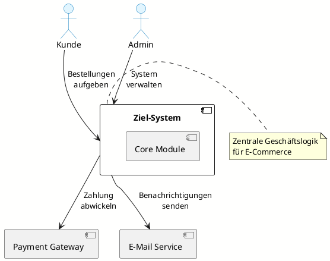
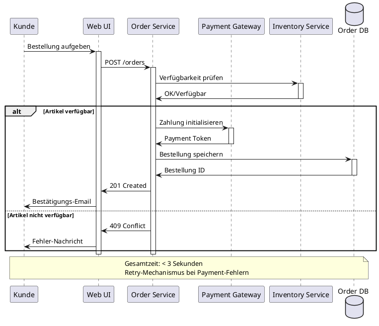

# PlantUML Diagramm-Generierung mit KI

## 1. Kontextdiagramme

### Basic Prompt für Fachlichen Kontext

```
Aufgabe: Erstelle ein PlantUML-Kontextdiagramm für [SYSTEM_NAME]

Akteure: [LISTE_DER_AKTEURE]
Systeme: [EXTERNE_SYSTEME]

PlantUML-Anforderungen:
- Nutze @startuml/@enduml
- Deutsche Beschriftungen
- Logische Gruppierung von Elementen
- Klare Datenfluss-Richtungen
- Lesbare Layout-Optimierung

Format: Vollständiger PlantUML-Code, compilierbar
```

### Erweiterte Prompt-Variante:

```
Erstelle ein technisches Kontextdiagramm als PlantUML-Code:

System: [SYSTEM_BESCHREIBUNG]
Schnittstellen: [PROTOKOLLE_UND_STANDARDS]
Sicherheitsanforderungen: [SECURITY_BOUNDARIES]

Spezifikationen:
- Zeige Protokolle bei jeder Verbindung
- Markiere Security-Boundaries mit Farben
- Nutze PlantUML-Stereotypen für Systemtypen
- Inkludiere Port-Nummern wo relevant

Zusätzlich: Legende für verwendete Symbole und Farben
```

### Template-Code:


## 2. Baustein-Diagramme

### Prompt für Ebene 1 (Grober Überblick)

```
Kontext: [SYSTEM_ARCHITECTURE_STRATEGY]
Aufgabe: Erstelle PlantUML für Bausteinsicht Ebene 1

Bausteine: [3-7 HAUPTKOMPONENTEN]
Beziehungen: [WICHTIGSTE_ABHÄNGIGKEITEN]

PlantUML-Spezifikation:
- Package-Struktur für logische Gruppierung
- Dependency-Pfeile mit Interface-Beschreibung
- Stereotypen für unterschiedliche Bausteintypen
- Konsistente Namenskonventionen

Zusätzlich:
- Kurze Verantwortlichkeits-Notizen
- Farbkodierung nach Verantwortungsbereich
```

### Template für Microservices:
```plantuml
@startuml Bausteinsicht_Ebene1
!define SERVICE component
!define DATABASE cylinder
!define GATEWAY component

skinparam component {
  BackgroundColor #E8F5E8
  BorderColor #2E7D32
}

package "Frontend Layer" #FFECB3 {
  SERVICE "Web UI" as web
  SERVICE "Mobile API" as mobile
}

package "Business Layer" #E3F2FD {
  SERVICE "User Service" as user
  SERVICE "Order Service" as order
  SERVICE "Catalog Service" as catalog
}

package "Data Layer" #FCE4EC {
  DATABASE "User DB" as userdb
  DATABASE "Order DB" as orderdb
  DATABASE "Product DB" as productdb
}

GATEWAY "API Gateway" as gateway

web --> gateway : HTTPS/REST
mobile --> gateway : HTTPS/REST
gateway --> user : Internal API
gateway --> order : Internal API
gateway --> catalog : Internal API

user --> userdb : SQL
order --> orderdb : SQL
catalog --> productdb : SQL

note bottom of gateway
  Authentifizierung,
  Rate Limiting,
  Load Balancing
end note
@enduml
```

## 3. Sequenz-Diagramme

### Prompt für Laufzeitsicht (Kapitel 6)

```
Kontext: [USE_CASE_BESCHREIBUNG]
Aufgabe: Erstelle PlantUML-Sequenzdiagramm für Laufzeitsicht

Akteure: [BENUTZER_UND_SYSTEME]
Ablauf: [SCHRITT_FÜR_SCHRITT_PROZESS]
Alternativen: [ERROR_CASES_UND_VARIANTEN]

PlantUML-Anforderungen:
- Participant-Deklarationen mit Stereotypen
- Aktivations-Balken für Processing-Zeit
- Alt/Opt-Blöcke für Bedingungen
- Notes für wichtige Business-Rules

Fokus: Kritische Pfade und Fehlerbehandlung
```

### Template für Bestellprozess:


## 4. Deployment-Diagramme

### Prompt für Verteilungssicht (Kapitel 7)

```
Kontext: [INFRASTRUKTUR_SETUP]
Aufgabe: Erstelle PlantUML-Deployment-Diagramm

Hardware: [SERVER_UND_NETZWERK_KOMPONENTEN]
Software: [SERVICES_UND_MIDDLEWARE]
Deployment: [CONTAINERIZATION_STRATEGY]

PlantUML-Spezifikation:
- Node-Definitionen für Hardware
- Artifact-Symbole für deploybare Einheiten
- Kommunikationspfade mit Protokollen
- Redundanz und Failover-Mechanismen

Zusätzliche Infos:
- Kapazitätsgrenzen
- Skalierungs-Möglichkeiten
- Security-Zonen
```

### Template für Cloud-Deployment:
```plantuml
@startuml Deployment_Diagramm
!define SERVER node
!define CONTAINER component
!define DATABASE cylinder

cloud "AWS Cloud" {
  SERVER "Load Balancer" as lb {
    CONTAINER "ALB" as alb
  }
  
  SERVER "Web Tier" as web_tier {
    CONTAINER "Nginx" as nginx
    CONTAINER "React App" as react
  }
  
  SERVER "App Tier" as app_tier {
    CONTAINER "API Gateway" as gateway
    CONTAINER "Microservice 1" as ms1
    CONTAINER "Microservice 2" as ms2
  }
  
  SERVER "Data Tier" as data_tier {
    DATABASE "PostgreSQL RDS" as postgres
    DATABASE "Redis Cache" as redis
  }
}

SERVER "External" as external {
  CONTAINER "Payment Provider" as payment
}

alb --> nginx : HTTPS/443
nginx --> react : Static Content
nginx --> gateway : /api/v1/*

gateway --> ms1 : gRPC
gateway --> ms2 : gRPC

ms1 --> postgres : SQL/5432
ms2 --> redis : Redis/6379
ms1 --> payment : HTTPS/REST

note bottom of lb
  Auto-Scaling Group
  Multi-AZ Deployment
  Health Checks
end note

note bottom of data_tier
  Backup Strategy: Daily
  Read Replicas: 2
  Encryption: at rest & transit
end note
@enduml
```

## 5. Konzept-Diagramme

### Prompt für Querschnittliche Konzepte (Kapitel 8)

```
Kontext: [SYSTEMÜBERGREIFENDES_KONZEPT]
Aufgabe: Visualisiere Konzept als PlantUML-Diagramm

Konzept: [z.B. Security, Logging, Configuration]
Komponenten: [BETEILIGTE_SYSTEME_UND_MODULE]
Datenfluss: [WIE_DAS_KONZEPT_UMGESETZT_WIRD]

Diagramm-Typ: [Class/Activity/State] je nach Konzept
Fokus: Wiederverwendbare Patterns und Standards
Notation: Einheitliche Symbole und Farben

Ziel: Verständnis systemübergreifender Mechanismen
```

### Template für Security-Konzept:
```plantuml
@startuml Security_Konzept
!define GATEWAY component
!define SERVICE component
!define SECURITY_MODULE component

package "Security Layer" #FFCDD2 {
  GATEWAY "API Gateway" as gateway
  SECURITY_MODULE "Auth Service" as auth
  SECURITY_MODULE "Token Store" as tokens
}

package "Business Services" #C8E6C9 {
  SERVICE "User Service" as user
  SERVICE "Order Service" as order
}

package "External" #E1BEE7 {
  component "Identity Provider" as idp
}

actor "Client" as client

client -> gateway : Request + JWT Token
gateway -> auth : Validate Token
auth -> tokens : Check Token Status

alt Token Valid
  auth -> gateway : User Claims
  gateway -> user : Authorized Request
  user -> gateway : Response
  gateway -> client : Protected Resource
else Token Invalid
  auth -> gateway : 401 Unauthorized
  gateway -> client : Authentication Error
end

auth <-> idp : OIDC/SAML

note over gateway, auth
  JWT-basierte Authentifizierung
  Role-based Access Control (RBAC)
  Token Rotation nach 24h
end note

note over tokens
  Redis-basiert
  TTL für automatische Bereinigung
  Blacklist für widerrufene Tokens  
end note
@enduml
```

## 6. Best Practices für KI-generierte Diagramme

### Qualitätskriterien:

1. **Syntaktische Korrektheit**
   - Valide PlantUML-Syntax
   - Vollständige @startuml/@enduml-Blöcke
   - Korrekte Stereotype und Schlüsselwörter

2. **Semantische Konsistenz**
   - Einheitliche Namenskonventionen
   - Konsistente Farbkodierung
   - Logische Abhängigkeitsrichtungen

3. **Visuelle Klarheit**
   - Angemessene Gruppierung mit Packages
   - Lesbare Layout-Optimierung
   - Aussagekräftige Notizen und Kommentare

### Iterative Verbesserung:

```
Optimiere das PlantUML-Diagramm für bessere Lesbarkeit:

Aktueller Code: [PLANTUML_CODE]
Probleme: [LAYOUT_ISSUES_ODER_UNKLARHEITEN]

Verbesserungen:
- Bessere Anordnung von Elementen
- Zusätzliche Farb- oder Form-Differenzierung
- Klarere Beschriftungen
- Entfernung von Redundanzen

Ziel: Professionelles, selbsterklärendes Diagramm
```

### Integration in arc42:

1. **Konsistente Referenzierung**: Verwende einheitliche IDs für Diagramme
2. **Versionierung**: Speichere PlantUML-Quellcode in Git
3. **Automatisierung**: Nutze Build-Pipeline für Diagramm-Generierung
4. **Dokumentation**: Ergänze Diagramme mit Textbeschreibungen